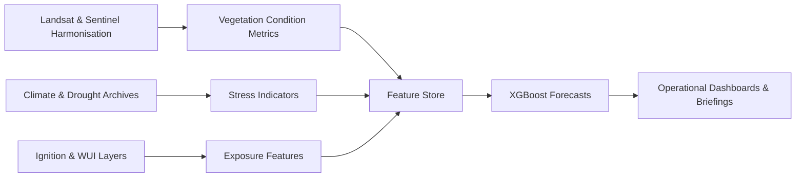

# Forest Disturbance Forecasting

!!! abstract "At a glance"
    - **Role:** Applied scientist, modeller, storyteller
    - **Objective:** Anticipate fire-driven disturbance windows to focus mitigation crews where they're needed most
    - **Status:** Prototype analytics package paired with dashboard concepts
    - **Stack:** R, Python, Google Earth Engine exports, PostGIS, Observable notebooks

## Why it matters
Western forests face compounding pressures from drought, pests, and expanding wildland-urban interfaces. Fire managers often rely on retrospective burn severity layers, yet have limited foresight into *where* conditions will align for the next large disturbance. This project experiments with predictive indicators that highlight short-term vulnerability across priority watersheds.

## Core components
- **Dynamic fuels monitoring** — fuse LANDFIRE surface fuels with MODIS and VIIRS vegetation condition indices to characterise daily readiness.
- **Weather & drought signals** — incorporate evaporative demand (ETo), VPD anomalies, and SPEI to capture accumulating stress.
- **Human activity context** — integrate road density, recent ignitions, and WUI boundaries to understand exposure.
- **Forecast engine** — train gradient-boosted models that emit 30-, 60-, and 90-day probability layers of high-severity disturbance.

## Workflow snapshot

## Outcomes so far
- Identified a **two- to three-month** lead window where combined vegetation and climate signals rise before large wildfires in pilot basins.
- Delivered interactive notebooks that let analysts probe feature importance by ecoregion, climate division, and ownership class.
- Co-designed mitigation maps with county partners, aligning forecast hotspots with staging areas and equipment caches.

## What comes next
1. Validate forecasts against additional seasons and incorporate suppression effectiveness metrics.
2. Wrap the workflow in a reproducible pipeline (`targets` or `prefect`) for scheduled execution.
3. Pair outputs with community-ready briefing templates to accelerate adoption.

## Related resources
- Concept dashboard sketches and prototypes live in the `docs/assets/` space (coming soon).
- Request access to model artefacts or demo sessions via the [GitHub profile contact form](https://github.com/Chathu84).
